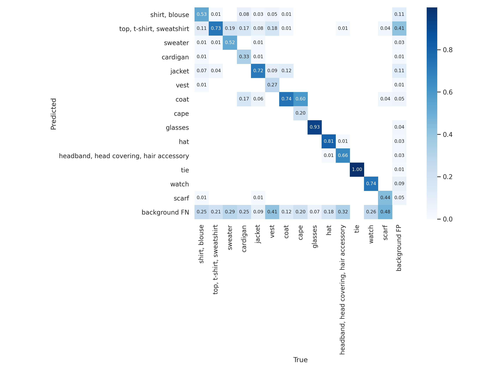

# Fashion-YOLO
[YOLOv5](https://github.com/ultralytics/yolov5)に[Fashionpedia](https://fashionpedia.github.io/home/index.html)というデータセットを学習させて服装を検出できるようにしました．

## セットアップ
### このレポジトリをクローン
```
git clone https://github.com/dsml-lab/YOLO_fashion.git
cd YOLO_fashion
```
### YOLOv5のレポジトリをクローン
```
git clone https://github.com/ultralytics/yolov5.git
```
### コンテナを起動
```
docker-compose -f docker-compose-dev.yaml up -d
```
```
docker-compose -f docker-compose-dev.yaml exec fashion bash
```
### データセット用意
[ここ](https://github.com/cvdfoundation/fashionpedia#images)から画像をダウンロードします．
```
cd datasets/images
wget https://s3.amazonaws.com/ifashionist-dataset/images/train2020.zip
unzip train2020.zip
wget https://s3.amazonaws.com/ifashionist-dataset/images/val_test2020.zip
unzip val_test2020.zip
```
`setup_dataset.py`を実行して，データセットのアノテーションをダウンロードし，YOLOv5学習用に整形します．
```
python setup_dataset.py
```
## 学習
### 参考
- https://github.com/ultralytics/yolov5/wiki/Train-Custom-Data#3-train
- https://github.com/ultralytics/yolov5/wiki/Tips-for-Best-Training-Results
```
python yolov5/train.py --img 1024 --batch 128 --epochs 300 --data datasets/dataset.yaml --weights yolov5s.pt --device 0,1 --project fashion --name YOLOv5
```
学習結果が `--project` で指定した名前のディレクトリに保存されます．
パラメータは `fashion/YOLOv5/weights/*.pt` です．

## 検出可能なもの（~~46~~ 14カテゴリ）
0. shirt, blouse
0. top, t-shirt, sweatshirt
0. sweater
0. cardigan
0. jacket
0. vest
0. coat
0. cape
0. glasses
0. hat
0. headband, head covering, hair accessory
0. tie
0. watch
0. scarf

## 混同行列


## APIサーバー
クライアントが画像を取得してAPIサーバに送ることで，ファッションアイテムを検出し，ファッションアイテムのカテゴリをkey，確信度をvalue とする辞書が返却されます．
### サーバー起動
学習した重み(`fashion/YOLOv5/weights/*.pt`)を`fasihonpedia.pt`にコピーしてください．
```
docker-compose -f docker-compose-prod.yaml up
```
### クライアント側サンプルコード
```python
import io
import time
import cv2
import requests
​
# カメラに接続（引数はデバイスのID）
cap = cv2.VideoCapture(0)
time.sleep(1)
# カメラから画像を取得し，バイトに変換
frame = cap.read()[1]
png_img = cv2.imencode('.png', frame)[1]
byte_img = io.BytesIO(png_img.tobytes())
# サーバに画像をおくる
host = '0.0.0.0'  # サーバのIPアドレス
port = 8000
url = f'http://{host}:{port}/api/detect-fashion-items'
files = {'file': ('image.png', byte_img)}
r = requests.post(url, files=files)
# 結果
result_dict = r.json()
print(result_dict)
```
### 出力例
```
{'shirt, blouse': 0.0, 'top, t-shirt, sweatshirt': 0.9543248984232345, 'sweater': 0.0, 'cardigan': 0.0, 'jacket': 0.0, 'vest': 0.0, 'coat': 0.0, 'cape': 0.0, 'glasses': 0.5219637751579285, 'hat': 0.0, 'headband, head covering, hair accessory': 0.0, 'tie': 0.0, 'watch': 0.0, 'scarf': 0.0}
```
実行すると，サーバー側の`detect/server/*jpg`に検出結果が保存されます．